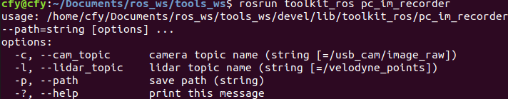
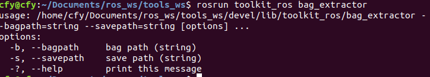

# Tools for ros

This repository collect some tools that help us to some work under ros framework. Each cpp file is a executable file to conduct one specified task.
- Data collection
    - **im_recoder**:  Record images from given topic and save them into given path
    - **pc_recoder**:  Record point cloud from given topic and save them into given path
    - **im_im_recorder**: Record images from two given topic and save them into given path
    - **pc_im_recorder**: Record images and point clouds from given topic and save them into given path  
    - **pc_im_recorder**: Record images and point clouds from given topic and save them into given path  
    - **pc_im_synchronizer**: Record images and point clouds from given topic and save them into given path. Moreover, a message filter is added to synchronize the data using each frame's timestamp.
    - **livox_map_recorder**: Record point clouds from given topic and given period. Save them into given path. It's for the points' accumulation to get dense pcd point cloud.
    - **livox_map_cam_recorder**: Record point clouds and images from given topic and given period. Save them into given path.
- Data analysis
    - **bag_extractor**: Unzip bag file, containing camera and LiDAR topics. You can set 1)save path, 2) bag path in command line. The program will process the data automatically without need to set topics and data type. 
    - **cov_kitti_bin2pc**: Convert bin files in kitti dataset to pcd files.

## Dependency 

- catkin: pcl_ros cv_bridge, image_transport, roscpp, sensor_msgs
- OpenCV
- Eigen

## Install

```
catkin_make
```
## Example


